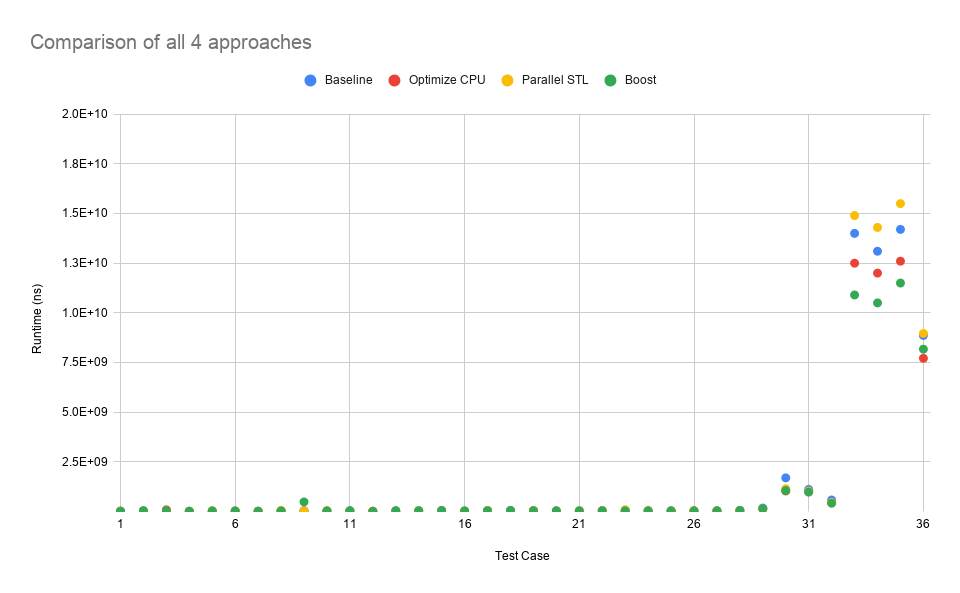

# CS5422 Homework 1 Report

107061517 張簡崇堯

[TOC]

## Implementation

### Data I/O

In my implementation, each rank has three local buffers, ``odd_buffer``, ``even_buffer`` and ``neighbor_buffer`` and a reference ``main_buffer`` to indicate the mainly used buffer of the rank.

In constructor, the ``main_buffer`` will point to ``odd_buffer`` or ``even_buffer`` according to the rank ID is odd or even.

I use MPI parallel I/O calls to read and write files simultaneously, the numbers read from the file will be store at ``main_buffer``.

### Sorting

After numbers are read, we need to perform one time sorting on ``main_buffer``, such that the merge function can works properly. I use the sorting algorithm from STL library in the beginning, I also tried Intel Parallel STL library in C++ 17, but the results are not satisfied (I will show the profiling results later).

Just one day before deadline, one of the classmates told me that using the ``float_sort`` from Boost library can significantly reduce the sorting time. Luckily, after applying Boost library, the total runtime is significantly reduced.

### Data exchange

In sequential version of odd-even sort, the abstraction level of **odd** or **even** is single number. However, if we use the same idea in parallel implementation, this approach will led to too many transmission calls with small data payload in flight.

In my implementation, to enhance data throughput and reduce the number of transmission calls, the abstrction level is **MPI rank**. In each timestamp, the rank with its rank ID is even will communicate to its neighbor rank (rank ID + 1). Simultaneously, the rank with its rank ID is odd will communicate to its neighbor rank (rank. ID - 1).

The numbers from the neighbor ranks will be stored at ``neighbor_buffer``.


### Merge function

After data exchange, the merge function will merge the numbers in ``main_buffer`` and ``neighbor_buffer``, and place the smaller numbers in ``odd_buffer`` (rank ID is even) or ``even_buffer`` (rank ID is odd).

The pseudo code of the merge function is shown below (merge takes smaller numbers in this case)

```c
void merge (source1, source2, destination) {
    input: source1, source2 //list
    output: destination //list

    while(source1, source2 not empty && destination not full) {
        if (head(source1) < head(source2)) {
            append head(source1) to destination
            drop head(source1)
        }
    }

    if(destination is not full) {
        if (source1 not empty) {
            fill destination with source1
        }
        else {
            fill destination with source2
        }
    }
}
```

### Status Synchronization

In order to know whether the sorting can be terminated or not, I use the ``MPI_Allreduce`` call to sync the sorting status.

## Experiment & Analysis

### Methodology

#### System Spec

The testing environment is apollo cluster, provided by TA.

#### Software Spec

LLVM 8.0.0, intel TBB library, Boost 1.69

#### Performance Metrics

##### Odd-Even Sort

I use C++ ``chrono`` library to mesure the following items, and dump the measured items in YAML format and CSV format.

To enable measurement, add ``-DPERF`` in compiler flags.

| Item             | Description                  |
| ---------------- | ---------------------------- |
| Mem              | Memory Allocation time       |
| Read             | MPI read file time           |
| Write            | MPI write file time          |
| MPI transmission | MPI send/receive calls' time |
| MPI sync         | MPI reduce calls' time       |
| Merge            | Merge function time          |
| Sort             | Sorting time                 |

The sum of the measured times is almost equal to the overall runtime (less than 10% error)

I use the seven indices above to generate the percentage stacked histogram, the I am able to apply *Amdahl's law* to analyze which part of the program could be optimized.

The runtime settings of the cluster are identical to the config files from TA, using different settings to run the test is meaningless.

I also noticed that Read/ Write time may be affected by whether the cluster is crownded or not, but I don't really care since there is nothing we can do improve its performance.

##### STL Sort

I perform profiling with C++ 17 Parallel STL and Boost library ``float_sort``, comparing the runtime of sorting a series of random numbers, the testing source code is accessible on my GitHub repository.

The range of input size is from 1 to 10,000,000. Each sorting method is tested 100 times and take the average runtime as the final runtime.

### Speedup Factor

#### Baseline


As the result shows, in testcase 1 to 28,  most of the time is spent on file I/O. Since I already apply parallel file I/O technique, I think there is nothing I can do to make them faster.

However, case 29 to 36 shows that sorting takes a lot of time. According to Amdahl's Law, it makes sense to me that I should find some way to make STL sort runs faster.

#### Improve CPU utilization in particular cases

I also noticed that in some cases, a rank will handle a very small amount of data, letting the data transmission time much longer than the sorting time (low CPU utilization). Therefore, I set a threshold, if the scheduling result shows that the numbers handling by a rank is smaller than the threshold, it will automatically use rank 0 to handle all the sorting process.


The result shows that in the small cases, the transmission overhead is reduced. But in the worst cases, the overall runtime is increased. I think this is due to the added branches.

#### Using Parallel STL

After searching on the internet, I found that in intel had implemented a **parallel version** of STL, and it had been added to C++ 17 standard. So I use the paralleled version of ``std::sort()`` instead of the sequential version.


Unfortunately, using paralleled version of ``std::sort()`` doesn't make anything better. The overall runtime is longer, and spend more proportion of time on sorting (from 44% grows to 47% in case 35).

I think this is caused by the cluster config that makes all the 12 ranks run on the same node, causing all the threads are competing for CPU time with each other. (Although you can use ``tbb::task_scheduler_init`` to decide how many threads to be created, the results aren't satisfied either.)

#### Sorting library comparison

Somehow I learned that using Boost library can significantly reduced the sorting time, so I tried to compare it with STL in sequential mode and parallel mode.

.png)

The plot above suggests that the ``float_sort`` function in Boost library has the smallest runtime in average compare to STL. Therefore, I use it in my implementation to achieve best performance.

#### Using Boost Library


It's obvious that the sorting time is significantly reduced among other parts, and the runtime is significantly reduced as well!

## Conclusion



A good library helps you a lot! Boost library is known as the leading edge C++ standard implementation. In this homework, it really  proves that its dedicated optimization on floating point sorting really helps a lot.

While doing performance optimization, figuring out why an approach didn't works well sometimes takes a lot of time.

BTW, I think writing Makefile is too complicated, a CMakeLists.txt can make things easier.

## Reference

[1]MPI Parallel I/O, <http://www.training.prace-ri.eu/uploads/tx_pracetmo/pio1.pdf>

[2]MPI Odd-Even Sort, <http://selkie-macalester.org/csinparallel/modules/MPIProgramming/build/html/oddEvenSort/oddEven.html>

[3]Merge Sort, <https://www.geeksforgeeks.org/merge-sort/>

[4]intel Parallel STL, <https://software.intel.com/en-us/articles/get-started-with-parallel-stl>

[5]Boost Float Sort,  <https://www.boost.org/doc/libs/1_67_0/libs/sort/doc/html/sort/single_thread/spreadsort/sort_hpp/float_sort.html>
