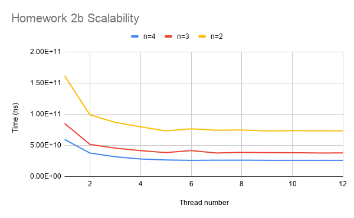
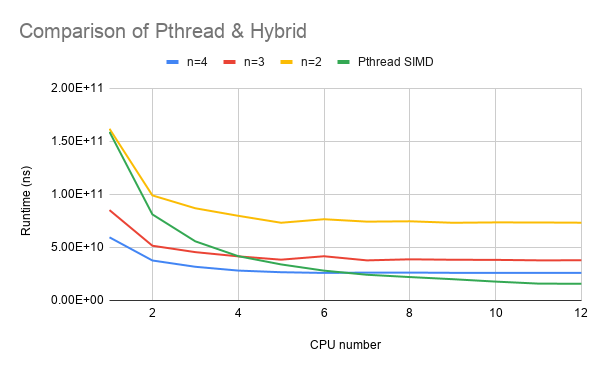

# CS5422 Homework 2 Report

107061517 張簡崇堯

[TOC]

## Implementation

### Job Scheduling Technique

I use dynamic scheduling technique in both of the two parts. For Pthread version, once a thread finishes its job, it'll automatically register the next chunk of pixels and do it. For MPI hybrid version, once a MPI rank finishes, the manager rank will assign new job for the rank. This technique can effectively achieve load balancing in big scale. (In some papers, the technique is so called job stealing or work stealing)

### Pthread version

#### Data Partition

I flatten the 2D image as a 1D array, I set a counter to record the pixels being processed by a thread. Each time after the thread finishes its job, it will try to lock the counter and increment 100 pixels . This apporach can effectively achieve load balancing of each thread and have good scalability.

#### Speed Up

In order to reduce the runtime, I use Intel ISPC compiler to help me generate the vectorized machine code for calculating each pixel. The runtime result shows that my program has almost 2x speed up, which is ideal to my hypothesis since the CPUs on Apollo cluster only supports SSE 4.2 extension, the width of the register is 128 bits, and we use `double` type in this homework, so the result is acceptable.

In spite of using SIMD instructions, I also add `builtin_expect` statement to speed up my program, since this approach can improve CPU branch prediction.

### MPI & OpenMP Hybrid

#### Data Partition

In this part, I divided image by width, each tile has  $10*width$ pixels and assigned to a MPI rank. In each rank, a single thread needs to handle $1 * width$ pixels. In a single thread, the pixels computation is vectorized using SSE instruction. I think this approach can improve cacahe spatial locality.

#### Speed Up

I do the same job as the Pthread version, using vectorized instruction and improve branch prediction.

## Experiment & Analysis

### Methodology

#### System Spec

For normal tests, the testing environment is Apollo cluster, provided by TA.

#### Software Spec

LLVM 8.0.0, intel ISPC compiler v1.12.0

#### Performance Metrics

To measure runtime, I use C++ `chrono` library, and I also implemented a simple wrapper for it.

Test parameter

```shell
174170376 -0.7894722222222222 -0.7825277777777778 0.145046875 0.148953125 2549 1439
```

* hw2a scalability: run on single machine, measure runtime from 1 CPU to 12 CPUs.
* hw2b scalability: run on 2 to 4 process, each process from 1 CPU to 12 CPUs.
* hw2a load balancing: run on 12 threads, measure the runtime of each thread.
* hw2b load balancing: run on 4 process with 12 threads, measure the runtime of each rank.

### Scalability

#### Pthread

.png)

| Thread num | Speed up |
| ---------- | -------- |
| 1          | 1        |
| 2          | 2.0x       |
| 3          | 3.0x     |
| 4          | 3.9x     |
| 5          | 4.8x     |
| 6          | 5.6x     |
| 7          | 4.8x     |
| 8          | 6.3x     |
| 9          | 7.0x     |
| 10         | 8.3x     |
| 11         | 8.9x     |
| 12         | 9.5x      |

.png)

| Thread num | Speed up |
| ---------- | -------- |
| 1          | 1        |
| 2          | 2.0x       |
| 3          | 2.8x     |
| 4          | 3.8x     |
| 5          | 4.7x     |
| 6          | 5.6x     |
| 7          | 6.5x     |
| 8          | 7.2x     |
| 9          | 7.9x     |
| 10         | 8.9x     |
| 11         | 9.9x     |
| 12         | 10.0x      |

The result shows that SIMD enabled version can achieve up to 10x faster than single thread version, Therefore have better scalability, but runs a little bit slower in this case. (However, SIMD enableed version runs faster in most cases)

#### Hybrid



The result shows that for process = 2 cases, the scalability is the best since there is only one process using multi thread approach to accelerate computation. In the best condition, the hybrid version can only achieve 2.2x faster compared to single CPU condition.

### Load Balancing

In my pthread original design, I split the image to tiles and assign them to each thread. This approach is not able to pass all the given test cases in a rational time limit. Then I apply dynamic scheduling technique and then pass all the given test cases. The variance among all threads is 2.806, it seems that the load balance is not that good as expected.

However, in hybrid version, the variance among all ranks is 0.489, which is rather better than the Pthread version.

## Conclusion



In modern multi-core era, MPI can't achieve good scalability when CPU thread is growing up. Many library tends to optimize for multi-core scenario, therefore, I think MPI is becoming less important nowadays.

BTW, I think the use of vectorized instruction should be automatic, writing intel intrinsics is like writing assembly codes, which has poor portability and readability. I think the right way to do this is using compiler tools to help us.

## Reference

[1]Intel® SPMD Program Compiler Performance Guide, <https://github.com/ispc/ispc/blob/master/docs/perfguide.rst#using-low-level-vector-tricks>
