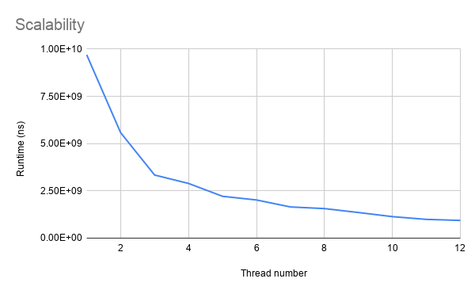
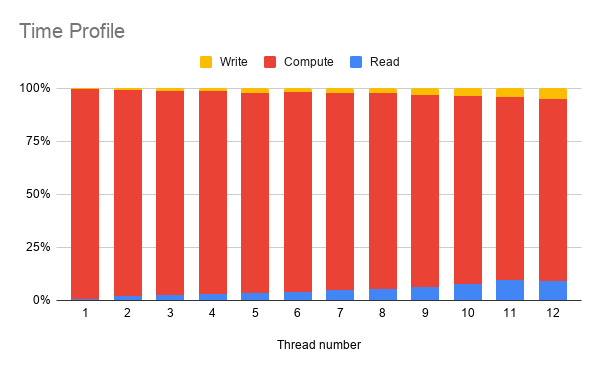

# CS5422 Homework 3 Report

107061517 張簡崇堯

[TOC]

## Implementation

### Algorithm

My implementation uses Floyd-Warshall algorithm, it uses dynamic programming approach, which is easy to parallelize.

### Time Complexity of the algorithm

The time complexity of the sequential version of Floyd-Warshall is $O(V^3)$, after we apply parallelism technique, the time complexity is degenerated to $O(V^3/P)$.

### How to generate test case

The experiment result suggests that more input edges led to longer runtime, so I generate the test case with 6,000 vertex and 35,994,000 edges.

I use the `mt19937` algorithm and `uniform_int_distribution` to generate each weight.

## Experiment & Analysis

### Methodology

#### System Spec

For normal tests, the testing environment is Apollo cluster, provided by TA.

#### Software Spec

GCC 9.1.0, intel ISPC compiler v1.12.0

#### Performance Metrics

To measure runtime, I use C++ `chrono` library.

#### Testcase

I use the `cases/c19.1` to test scalability and do time profiling. 

### Scalability

| Thread num | Speed up |
| ---------- | -------- |
| 1          | 1        |
| 2          | 1.7x    |
| 3          | 2.9x  |
| 4          | 3.4x    |
| 5          | 4.4x    |
| 6          | 4.8x   |
| 7          | 5.9x  |
| 8          | 6.2x    |
| 9          | 7.2x    |
| 10         | 8.5x    |
| 11         | 9.8x   |
| 12         | 10.4x  |

The result of the scalability test shows that my implementation have strong scalability.

### Time profile

The result shows that the APSP problem is computational bound, and we can see that the portion becomes smaller as the thread number grows, which tells us the parallelism really helps!

## Conclusion

In this homework, I have tried intel TBB and OpenMP. But the result shows that OpenMP somehow runs faster than TBB even if I use the same scheduling technique. I'm confused with the result, so I hopo that TA can give me some explanation on this circumstance.

Besides thread level parallelism, I also discuss with my classmate about using SIMD instruction to speed up the computation. I use intel ISPC and my classmate uses intel intrinsic to implement it. But both of us got frustrated results. According to the scoreboard, I see that there is one othrer classmate successfully speed up the computation up to 2x. I wonder if TAs can let him come to the stage to show how to do this.

## Reference

[1]Intel® SPMD Program Compiler Performance Guide, <https://github.com/ispc/ispc/blob/master/docs/perfguide.rst#using-low-level-vector-tricks>