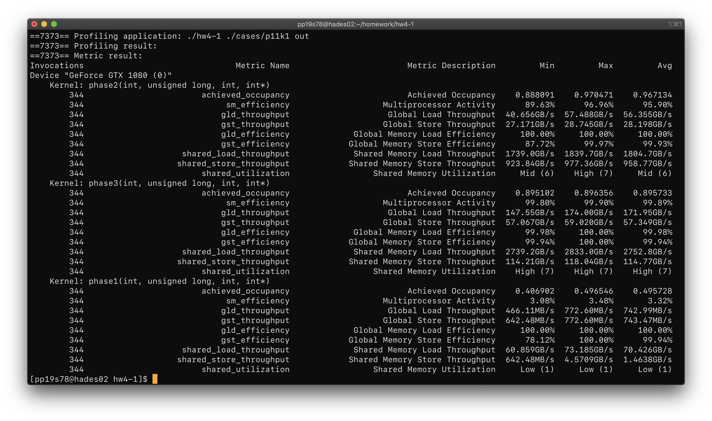
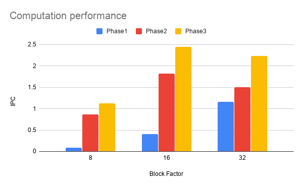
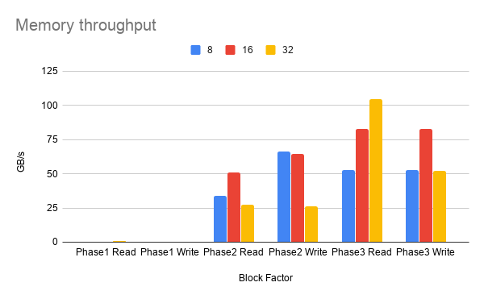
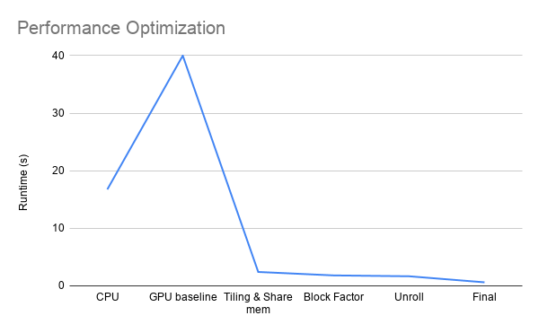
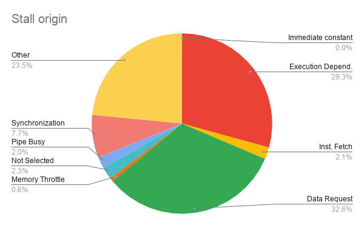

# CS5422 Homework 4-1 Report

107061517 張簡崇堯

[TOC]

## Implementation

### How to divide data

In the Blocked Floyd-Warshall algorithm implementation, the original graph is divided by GPU block.

The following code clearly shows how data is partitioned in each phase.

```c++
void cudaBlockedFW(const std::unique_ptr<Graph> &dataHost) {
    const int nvertex(dataHost->nvertex);
    const int block_num(std::ceil((float)nvertex / BLOCK_SIZE));
    const dim3 gridPhase1(1, 1);
    const dim3 gridPhase2(block_num, 2);
    const dim3 gridPhase3(block_num, block_num);
    const dim3 dimBlockSize(BLOCK_SIZE, BLOCK_SIZE);
    int *graphDevice(NULL);

    size_t pitch = _cudaMoveMemoryToDevice(dataHost, &graphDevice);
    for (int blockID = 0; blockID < block_num; ++blockID) {
        // phase1
        phase1 <<<gridPhase1, dimBlockSize>>>
            (blockID, pitch / sizeof(int), nvertex, graphDevice);
        // phase2
        phase2 <<<gridPhase2, dimBlockSize>>>
            (blockID, pitch / sizeof(int), nvertex, graphDevice);
        // phase3
        phase3 <<<gridPhase3, dimBlockSize>>>
            (blockID, pitch / sizeof(int), nvertex, graphDevice);
    }
    _cudaMoveMemoryToHost(graphDevice, dataHost, pitch);
}
```

My implementation follows the homework instruction to build each phase.

In phase 1, which is self dependent block, so the kernel function only runs one time for each block and handle the data within current block.

In phase 2, which is partial dependent block, the kernel function runs $2 * number\space of\space block$ time to handle correspoding row and column.

In phase 3, which is independent block, the kernel function runs $number\space of\space block * number\space of\space block$ time to handle the whole graph.

### Configuration

The block size is set to $(32, 32)$ after profiling. The result shows that this configuration can achieve best performance.

## Profiling

### Methodology

#### System Spec

Hades GPU cluster

#### Software Spec

NVCC 9.0 with GCC 4.8.5

#### Performance Metrics

1.  occupancy
2.  sm_efficiency
3.  shared memory load/store throughput
4.  global memory load/store throughput

#### Testcase

I use the `cases/p11k1` during all tests.

### Results

### 

*   Occupancy: The result shows that the occupancy of phase 1 kernel is rather low compare to the following two phases. I think phenomena is due to the amount of data being processed is rather small in phase1. Which means the load balancing among phases is not really good.

*   Multiprocessor efficiency: It's clear that in phase 2 and phase 3, the efficiency are very high. Which means the utilization of SM processors are almost full most of the time.

*   Data throughput: Compare memory throughput among 3 phases, it's clear that in order to improve throughput, we need to fill input data as much as possible. The phase 1 kernel only handles $(1,1)$ grid at a time, which led to the low throughput compare to other phases.

*   Share memory utilization: In my implementation, share memory is used as cache. The more we use it, it helps us save more runtime. Since we handle all the input data in phase 3, the result shows that the share memory utilization is high compare to other phases.

    To sum up, since most of the time is spent on phase 3, if I want to gain significant improvement, I need to find some way to speed up phase 3 computation. A possible approach is to let one kernel function to process more data at a time.

## Experiment & Analysis

### Methodology

Same as profiling.

###Time distribution

I use `nvprof` tool to measure percentage of  time in my program.  I use `cases/p11k1` for all tests.

#### Block size = 8

| Item         | H to D | Phase 1 | Phase 2 | Phase 3 | D to H |
| ------------ | ------ | ------- | ------- | ------- | ------ |
| % of runtime | 0.68%  | 0.02%   | 0.21%   | 98.48%  | 0.62%  |

Runtime: 11827 ms

#### Block size = 16

| Item         | H to D | Phase 1 | Phase 2 | Phase 3 | D to H |
| ------------ | ------ | ------- | ------- | ------- | ------ |
| % of runtime | 2.15%  | 0.04%   | 0.42%   | 95.48%  | 2.15%  |

Runtime: 4026 ms

#### Block size = 32

| Item         | H to D | Phase 1 | Phase 2 | Phase 3 | D to H |
| ------------ | ------ | ------- | ------- | ------- | ------ |
| % of runtime | 2.82%  | 0.05%   | 1.08%   | 93.55%  | 2.5%   |

Runtime: 3105 ms

It's clear that computation takes less portion of time as the block size grows, while memory copy takes more. If we look deeper, the phase3 takes less portion while phase1 and phase2 takes more portion of time. This observation suggest that we should use larger block size to improve performance.

### Computation Performance

Note: Since `nvprof` returns error while using metric `inst_integer`, we use `ipc` instead.



From the experiment results previously, we knew that when block size is set to 32, the runtime is the shortest. The IPC (instruction executed per cycle) plot clearly shows that the improvement is contributed by the phase 1 IPC improvement.

### Device Memory Throughput

In this experiment, I measure the device memory throughput instead of global memory bandwidth since memory bandwidth is a fixed value depending on memory layout.



As the figure shows, we can see that when block size is set to 32, the phase 2 throughput is significantly lowered, which gives me a clue to find out the IPC is lowered in phase 2.

###Optimization



The figure above shows how I do the optimization. The use of loop tiling and share memory significantly optimize the program, applying block factor  tuning and loop unrolling also improve the performance.

### Kernel Stall Analysis

In this part, I use `nvprof` to profile kernel and try to find out what causes stalls in the kernel.



As the plot above, the stall is caused by data request mostly. Therefore, we can conclude that my program is bounded by data required. And the data request stall will led to execution delay. From this analysis, I understood that my program is bounded by memory.

## Conclusion

In this homework, I realize that optimizing CUDA program is not easy. Programmers need to optimize many factors, including coalescing memory access, managing data movement between gloabal, shared, and register memory, and inserting synchronization primitives. Therefore, I think automatically codegen framework for high performance computing is really important. 