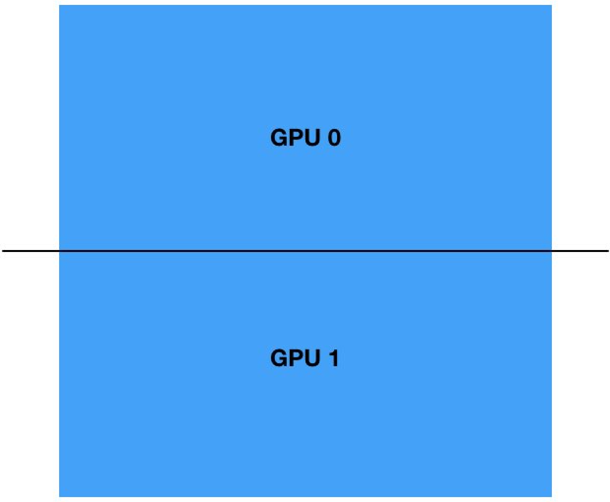
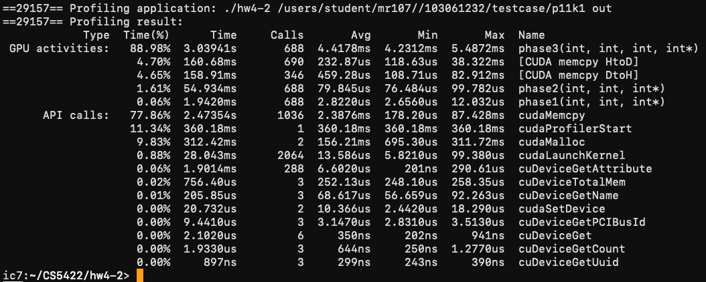
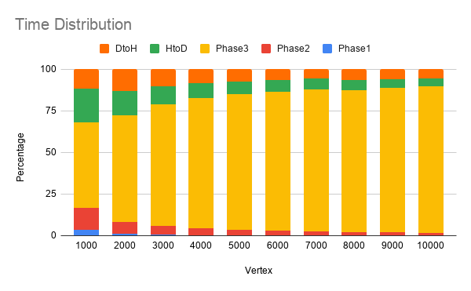
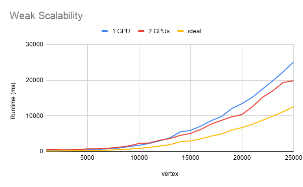
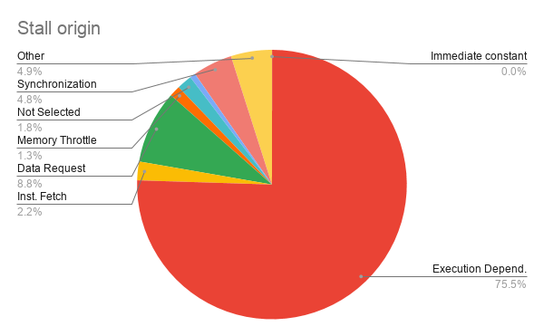

# CS5422 Homework 4-2 Report

107061517 張簡崇堯

[TOC]

## Implementation

### How to divide data

In the single-GPU version, I use the following method to divide data and map them onto two GPUs.

The vertex is extended to the multiple of block dimension, which reduces extra branches in kernel function.

However, this approach will waste extra memory.

### How do you implement the communication

The number of integer data copying in each iteration is reduced to $Vertex * BlockSize$, which reduces the time of memory copying.

## Experiment & Analysis

### Methodology

#### System Spec

CPU: Intel Xeon CPU  Silver 4110

RAM: 64 GB

GPU: GeForce GTX 1080 Ti * 3

#### Software Spec

Ubuntu 18.04.3

CUDA Runtime Version = 10.1

nvcc 10.0 with gcc 7.4.0

### Time distribution

| Item         | H to D | Phase 1 | Phase 2 | Phase 3 | D to H |
| ------------ | ------ | ------- | ------- | ------- | ------ |
| % of runtime | 4.7 %  | 0.06 %  | 1.61 %  | 88.98 % | 4.65   |

The runtime is measured via running `p11k1` testcase.

The time distribution shows that the time spent on memory copy is doubleed compared to single GPU version.

The chart below shows the time distribution on different input size.

Note that the real problem size is the square of vertex.

The chart above shows the `phase3` takes more porportion as the vertex grows. Since my implementation reduces the size of data sync in each round, the time spent on data movement is not significantly grows up.

### Weak Scalability

As the figure above shows, when the data size is small, the multi-GPU version runs slower compares to the single-GPU version until the data is big enough (V = 13000). Comparing multi-GPU runtime curve to ideal speed up curve, we can see that the enhancement of parallelism is not significant, which suggests its weak scalability.

The runtime is measured via `chrono` library, the testcases are generated by random generator.

### Stall Analysis

As the figure show, execution dependency is the main source of kernel stall. According to NVIDIA Development Document,  execution dependency is defined when an input required by the instruction is not yet available, and it can potentially be reduced by increasing instruction-level parallelism.

## Conclusion

In this homework, I understood that an effective method to sync data between acceleration devices is important. Although data synchronization is not the bottleneck in this assignment, in my implementation, I use a barrier to synchronize two threads to make sure the two GPU cards holds the latest data, which takes to extra waiting cycles.