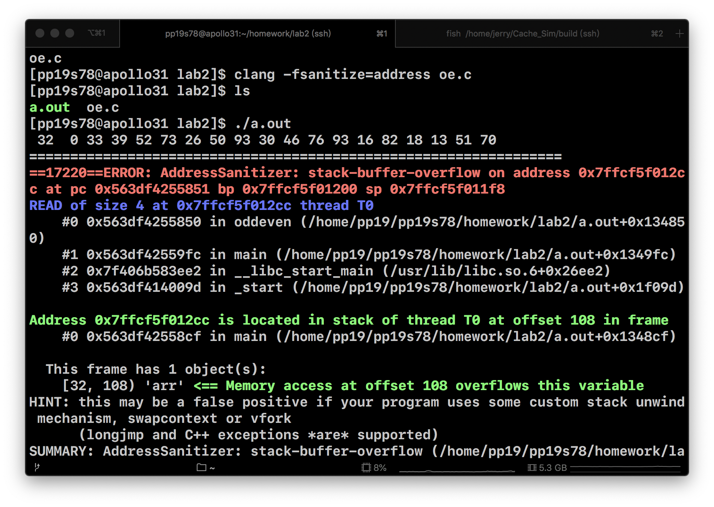

# Lab2 Report

#### 107061517 張簡崇堯

## Compile with Address Sanitizer and run



## Debug

From the report given from Address Sanitizer, it's obvious that we have illegally accessed some invalid addresses in function `odd_even`. So take a look at the source code.

```c
void oddeven(int* arr, int len) {
    for (int i = 0; i < len; i++) {
        for (int j = i % 2; j < len; j++) {
            if (arr[j] > arr[j+1]) {
                swap(&arr[j], &arr[j+1]);
            }
        }
    }
}
```

It's obvious that when `j = len - 1`, the comparison `arr[j] > arr[j+1]` will read illegal address since C language is 0 indexed. So I revised the function as follow

```c
void oddeven(int* arr, int len) {
    for (int i = len; i > 0; i--) {
        for (int j = i % 2; j < len; j++) {
            if (arr[j] > arr[j+1]) {
                swap(&arr[j], &arr[j+1]);
            }
        }
    }
}
```

Then the program can sort the array successfully.
