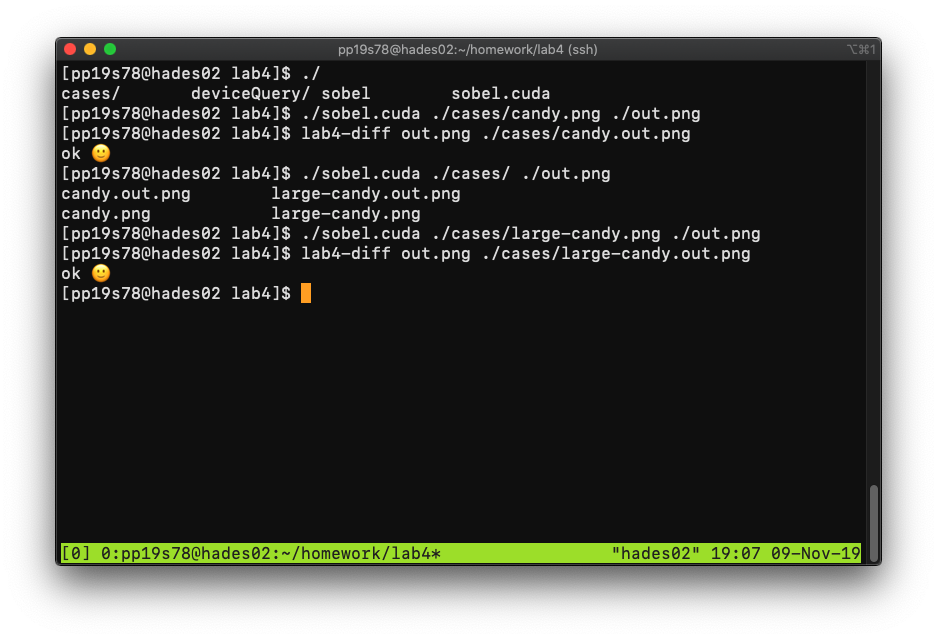
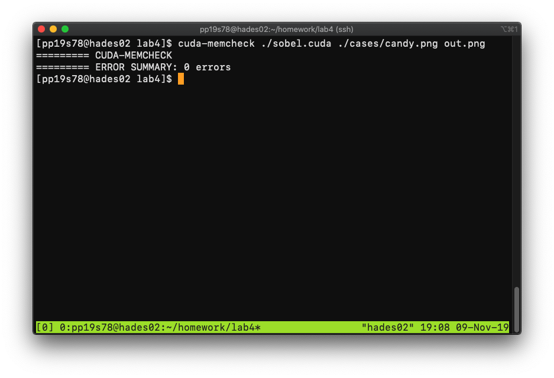
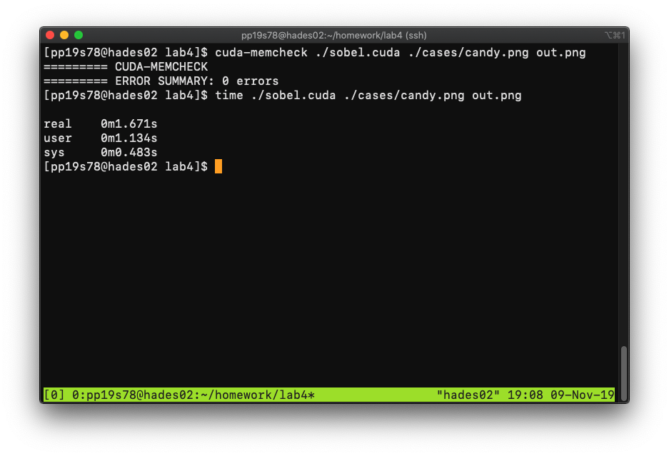
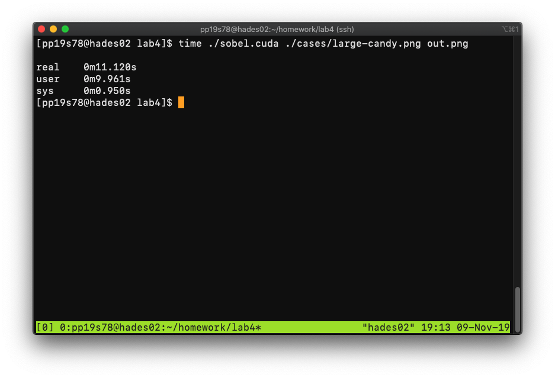

# Lab4 Report

#### 107061517 張簡崇堯

## Correctness

The testing program return ok in the two given cases.

## Cuda-memcheck result

There is no any memory error in my program.

## Measurement of computation time

Use builtin `time` program to measure the Sobel Filter runtime. 

|      | Candy  | Large-candy |
| ---- | ------ | ----------- |
| CPU  | 5.16 s | 53.71 s     |
| GPU  | 1.13 s | 9.96 s      |

The result shows that the GPU version can achieve up to 5.4x faster than CPU version.

## Code explanation

1.  Use `cudaMallocPitch` to allocate 2D memory, and preallocate 2 pixels for each edge to prevent image becomes smaller after convolution.
2.  Preallocate 5*5 filter on device memory.
3.   `nvcc` can't handle inline function, use `adjustX` and `adjustY` to prevent out of boundary.
4.  Divide the image by height, use 256 threads in parallel.

