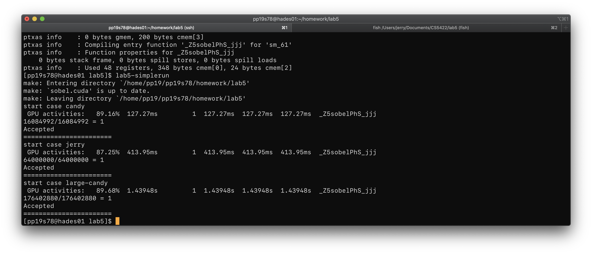
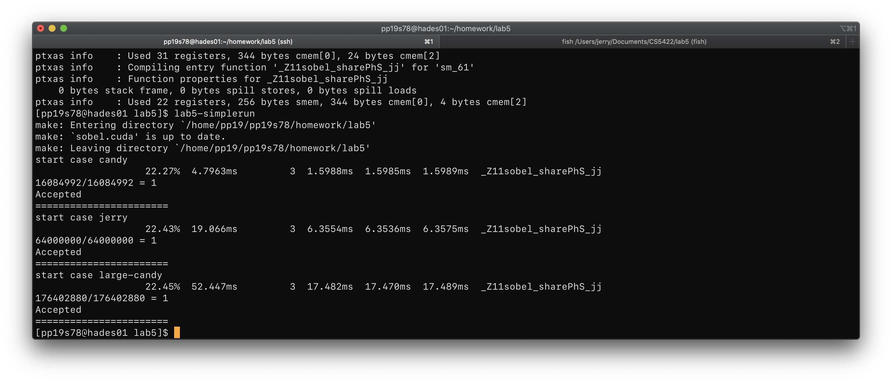
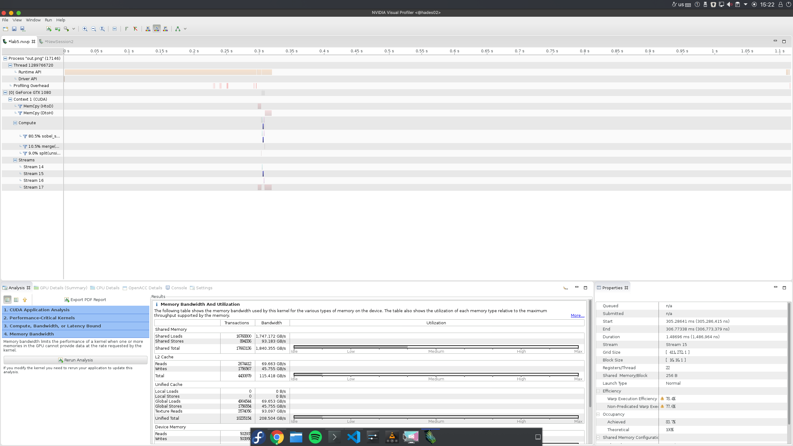
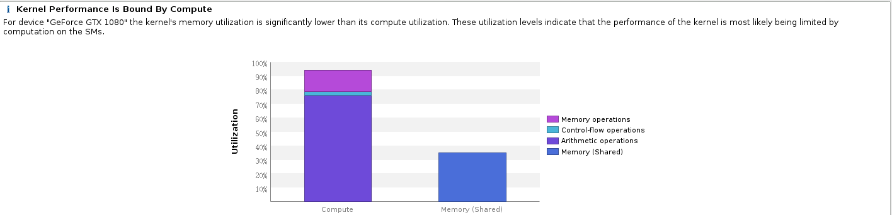

# Lab5 Report

#### 107061517 張簡崇堯

## Code explanation

1.  Use 2D block to parallelize both x and y axis.
2.  Split R,G,B channels, use CUDA stream to compute them in parallel, but somehow the profiler told me that they can't be launced in parallel. That's weird.
3.  Use share memory to buffer input data, which significantly reduce kernel runtime.

## Measurement of computation time

Use builtin `lab5-simplerun` program to measure the CUDA kernel runtime. 

After optimization, the kernel runtime is reduced as follows

|           | Candy    | Jerry  | Large-candy |
| --------- | -------- | ------ | ----------- |
| Reference | 127.3 ms | 414 ms | 1439.5 ms   |
| Optimized | 4.8 ms   | 19 ms  | 52.5 ms     |

The result shows that the optimized version can achieve up to 27x faster than the reference version.

## Profile Result

I use `nvvp` profiler to see how my program works.

From the profile result, it's clear that the program is bounded by memory operation. Most of the time is spent on memory allocation.

From the kernel analysis result, it's clear that the optimized version almost use the memory warp as much as possible, the kernel is bounded by computation.

## Problems

It's wierd that the 3 color channels aren't launch in parallel after I use cuda stream to launch them. I'm curious about this phenomenon. I hope TA can give me some explanation.